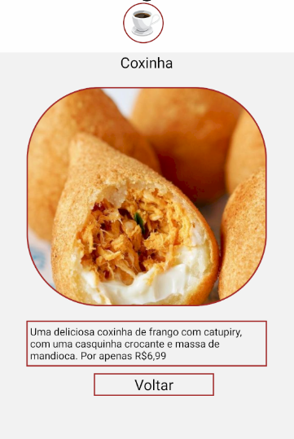

<h1 align="center"> Liv's Coffe </h1>

<h1 align="center">
    <a href="https://reactnative.dev/">🔗 React Native</a>
   
</h1>

  ## Descrição: Cafeteria da Lívia Belão.
  ## Tecnologias Utilizadas: Rect Native, Biblioteca Stack, Androi Studium, VS code, JavaScript, CSS.

<h1 align="center">
    <a href="https://support.github.com/contact/bug-report">Reporta erro</a>
</h1>

## Primeiros Comandos.
Ao inicial o projeto, vá até o terminal e digite os seguintes comandos. 

bash
npm run start
